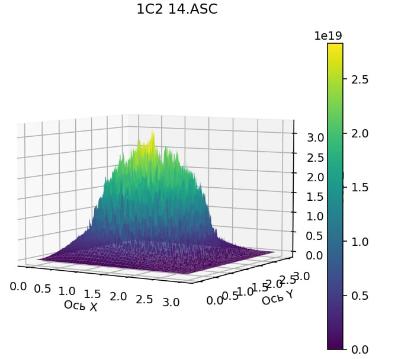

# 3D graphs

Главная задача данного проекта была в том, чтобы помочь одному знакомому в его работе, он обрабатывал огромные объемы данных вручную и так же строил графики, я решил помочь ему в его нелёгком деле.

## usage

Создаем виртуальное окружение, скачиваем библиотеки 
```
pip install -r requirements.txt
```
Запускаем
```
python3 main.py
```
выбираем одну из директорий (dataset1 или dataset2, рекомендую выбрать dataset1, так как там меньше данных, всё посчитается гораздо быстрее), после этого создается файл analytics.log, в нём пишутся логи обработки файлов. Когда обработка закончится, отрисуется 3D график. Пример итогового графика:<br>


## core

Суть этой программы в поиске "среднего графика". В папке dataset1 находится два файла, это два разных графика. Допустим в одном графике по координатам x = 0, y = 0, z = 1. В другом графике есть точка x = 0, y = 0, z = 2. В итоговом графике будет точка так же по координатам x = 0, y = 0, а координата z = 1.5. Для всех точек в каждом графике находится средняя высота точки (координата z). Ради этого создавалась данная программа.

## misk

Обрабока заключается в том, что иногда в файлах с данными встречаются испорченные данные (вы можете найти значение Bad в этих файлах), программа избавляется от этих неправильных данных, подставляя туда наиболее вероятные значения. Эти данные представляют собой надор точек, которые надо отобразить на графике, но график может быть смещён по оси x или y, поэтому следующим этапом я выравниваю график так, чтобы он стоял по центру. Так же один график может быть допустим 100 точек по х и на 100 точек по у, второй график может быть 90 точек на 90 точек, в таком случае я ко второму графику дописываю недостающие точки, в которых по оси z значения равны нулю. 